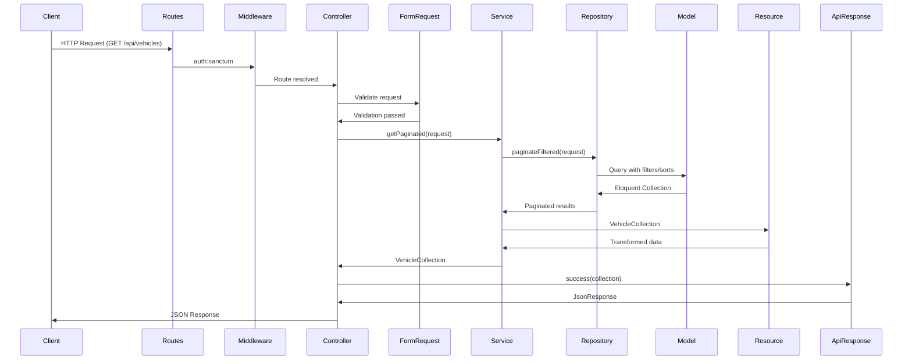

# Application Architecture & Design Patterns

This document explains the layered architecture and design patterns used in this Laravel application, using the **Vehicle** resource as a concrete example throughout.

## Table of Contents

1. [Overview](#overview)
2. [Request Flow Diagram](#request-flow-diagram)
3. [Layer-by-Layer Breakdown](#layer-by-layer-breakdown)
4. [Design Patterns Explained](#design-patterns-explained)
5. [Complete Request Flow Examples](#complete-request-flow-examples)
6. [Query Building Features](#query-building-features)
7. [Key Files Reference](#key-files-reference)
8. [Best Practices](#best-practices)

---

## Overview

This application follows a **layered architecture** with clear separation of concerns. Each layer has a specific responsibility, making the codebase maintainable, testable, and scalable.

### Key Design Patterns

1. **Repository Pattern**: Abstracts data access logic from business logic
2. **Service Layer Pattern**: Encapsulates business logic and orchestrates operations
3. **Dependency Injection**: Enables loose coupling through interface-based bindings
4. **Template Method Pattern**: Provides reusable base implementations with customizable hooks

### Architecture Benefits

- **Testability**: Each layer can be tested independently with mocks
- **Maintainability**: Changes in one layer don't cascade to others
- **Flexibility**: Easy to swap implementations (e.g., different repositories)
- **Reusability**: Base classes provide common functionality
- **Consistency**: Standardized patterns across all resources

### Request Flow Overview

```
HTTP Request
    ↓
Routes (with Middleware)
    ↓
Controller (Thin - delegates to Service)
    ↓
Form Request (Validation)
    ↓
Service (Business Logic)
    ↓
Repository (Data Access)
    ↓
Model (Eloquent)
    ↓
Resource (API Transformation)
    ↓
ApiResponse (Standardized Format)
    ↓
JSON Response
```

---

## Request Flow Diagram

The following diagram illustrates the complete request flow from HTTP request to JSON response:



---

## Layer-by-Layer Breakdown

### 3.1 Routes Layer

**File**: [`routes/api/vehicles.php`](routes/api/vehicles.php)

Routes define the entry points to the application. They register endpoints and apply middleware.

```php
Route::middleware('auth:sanctum')->name('api.vehicles.')->group(function (): void {
    Route::get('vehicles/prerequisites', [VehicleController::class, 'prerequisites'])
        ->name('vehicles.prerequisites');
    Route::apiResource('vehicles', VehicleController::class);
});
```

**Key Points**:
- All routes require `auth:sanctum` middleware for authentication
- Routes are grouped with a common name prefix (`api.vehicles.`)
- `apiResource` automatically creates RESTful routes (index, store, show, update, destroy)
- Custom routes (like `prerequisites`) can be added alongside resource routes

**Generated Routes**:
- `GET /api/vehicles` → `VehicleController@index` (name: `api.vehicles.index`)
- `POST /api/vehicles` → `VehicleController@store` (name: `api.vehicles.store`)
- `GET /api/vehicles/{vehicle}` → `VehicleController@show` (name: `api.vehicles.show`)
- `PUT/PATCH /api/vehicles/{vehicle}` → `VehicleController@update` (name: `api.vehicles.update`)
- `DELETE /api/vehicles/{vehicle}` → `VehicleController@destroy` (name: `api.vehicles.destroy`)

---

### 3.2 Controller Layer

**File**: [`app/Http/Controllers/Api/VehicleController.php`](app/Http/Controllers/Api/VehicleController.php)

Controllers are **thin** - they delegate business logic to services and focus on HTTP concerns.

```php
final class VehicleController extends Controller
{
    use AuthorizesRequests;
    use InvalidatesCachedModels;
    use UsesCachedResponses;

    public function __construct(
        private readonly VehicleServiceInterface $service,
    ) {}

    public function index(VehicleIndexRequest $request): JsonResponse
    {
        $collection = $this->service->getPaginated($request);
        return ApiResponse::success($collection);
    }

    public function store(StoreVehicleRequest $request): JsonResponse
    {
        $vehicleResource = $this->service->createVehicle($request->validated());
        return ApiResponse::created($vehicleResource);
    }

    public function show(Vehicle $vehicle): JsonResponse
    {
        $vehicleResource = $this->service->show($vehicle);
        return ApiResponse::success($vehicleResource);
    }

    public function update(UpdateVehicleRequest $request, Vehicle $vehicle): JsonResponse
    {
        $vehicleResource = $this->service->updateVehicle($vehicle, $request->validated());
        return ApiResponse::success($vehicleResource);
    }

    public function destroy(Vehicle $vehicle): JsonResponse
    {
        $this->service->deleteVehicle($vehicle);
        return ApiResponse::noContent('Vehicle deleted successfully');
    }
}
```

**Key Points**:
- **Dependency Injection**: Service is injected via constructor
- **Thin Controllers**: Controllers don't contain business logic
- **Form Requests**: Validation handled by dedicated request classes
- **Standardized Responses**: All responses use `ApiResponse` class
- **Concerns**: Reusable traits for caching and cache invalidation
- **Authorization**: Ready to use (currently commented out, awaiting policies)

**Controller Responsibilities**:
1. Receive HTTP requests
2. Validate via Form Requests
3. Delegate to Service layer
4. Return standardized JSON responses
5. Handle HTTP status codes

---

### 3.3 Form Request Layer

**Files**:
- [`app/Http/Requests/Vehicles/StoreVehicleRequest.php`](app/Http/Requests/Vehicles/StoreVehicleRequest.php)
- [`app/Http/Requests/Vehicles/UpdateVehicleRequest.php`](app/Http/Requests/Vehicles/UpdateVehicleRequest.php)
- [`app/Http/Requests/Vehicles/VehicleIndexRequest.php`](app/Http/Requests/Vehicles/VehicleIndexRequest.php)

Form Requests handle validation and authorization before the request reaches the controller.

#### StoreVehicleRequest

```php
final class StoreVehicleRequest extends FormRequest
{
    public function rules(): array
    {
        return [
            'make'          => ['required', 'string', 'max:255'],
            'model'         => ['required', 'string', 'max:255'],
            'year'          => ['required', 'integer', 'min:1900', 'max:' . (date('Y') + 1)],
            'license_plate' => ['required', 'string', 'max:20', 'unique:vehicles,license_plate'],
            'vin'           => ['nullable', 'string', 'max:255', 'unique:vehicles,vin'],
            'status'        => ['sometimes', Rule::enum(VehicleStatus::class)],
            'drivers'       => ['sometimes', 'array'],
            'drivers.*'     => ['exists:users,id'],
        ];
    }
}
```

#### UpdateVehicleRequest

```php
final class UpdateVehicleRequest extends FormRequest
{
    public function rules(): array
    {
        return [
            'make'          => ['sometimes', 'string', 'max:255'],
            'model'         => ['sometimes', 'string', 'max:255'],
            'year'          => ['sometimes', 'integer', 'min:1900', 'max:' . (date('Y') + 1)],
            'license_plate' => [
                'sometimes', 'string', 'max:20',
                Rule::unique('vehicles', 'license_plate')->ignore($this->vehicle),
            ],
            'vin' => [
                'nullable', 'string', 'max:255',
                Rule::unique('vehicles', 'vin')->ignore($this->vehicle),
            ],
            'status'    => ['sometimes', Rule::enum(VehicleStatus::class)],
            'drivers'   => ['sometimes', 'array'],
            'drivers.*' => ['exists:users,id'],
        ];
    }
}
```

#### VehicleIndexRequest

Handles validation for query parameters (filters, sorts, includes, pagination):

```php
final class VehicleIndexRequest extends BaseIndexFormRequest
{
    protected function filterRules(): array
    {
        return [
            'filter.make'          => 'sometimes|string|max:255',
            'filter.model'         => 'sometimes|string|max:255',
            'filter.year'          => 'sometimes|integer',
            'filter.license_plate' => 'sometimes|string|max:20',
            'filter.status'        => 'sometimes|string|in:active,maintenance,inactive',
        ];
    }

    protected function getAllowedSorts(): array
    {
        return ['id', '-id', 'make', '-make', 'model', '-model', ...];
    }

    protected function getAllowedIncludes(): array
    {
        return ['drivers'];
    }
}
```

**Key Points**:
- **Separation**: Validation logic separated from controllers
- **Reusability**: Can be reused across different endpoints
- **Type Safety**: Validation rules ensure data integrity
- **Query Validation**: Index requests validate query parameters

---

### 3.4 Service Layer

**File**: [`app/Services/Concretes/VehicleService.php`](app/Services/Concretes/VehicleService.php)

Services encapsulate **business logic** and orchestrate operations between repositories and other services.

```php
final class VehicleService extends BaseService implements VehicleServiceInterface
{
    private readonly VehicleRepositoryInterface $repo;

    public function __construct(
        VehicleRepositoryInterface $repo,
    ) {
        $this->setRepository($repo);
        $this->repo = $repo;
    }

    public function getPaginated(Request $request): VehicleCollection
    {
        $paginated = $this->repo->paginateFiltered($request);
        return new VehicleCollection($paginated);
    }

    public function show(Vehicle $vehicle): VehicleResource
    {
        $vehicle = $this->repo->findForShow($vehicle);
        return new VehicleResource($vehicle);
    }

    public function createVehicle(array $data): VehicleResource
    {
        $vehicle = $this->repo->createWithRelationships(Arr::except($data, ['drivers']));
        $this->syncDrivers($vehicle, $data);
        return new VehicleResource($vehicle);
    }

    public function updateVehicle(Vehicle $vehicle, array $data): VehicleResource
    {
        $updated = $this->repo->updateWithRelationships($vehicle, Arr::except($data, ['drivers']));
        $this->syncDrivers($updated, $data);
        return new VehicleResource($updated);
    }

    public function deleteVehicle(Vehicle $vehicle): bool
    {
        return $this->repo->delete($vehicle);
    }

    private function syncDrivers(Vehicle $vehicle, array $data): void
    {
        if (isset($data['drivers'])) {
            $vehicle->drivers()->sync($data['drivers']);
            $vehicle->load('drivers');
        }
    }
}
```

**Key Points**:
- **Business Logic**: Handles complex operations (e.g., syncing relationships)
- **Orchestration**: Coordinates between repository and resources
- **Returns Resources**: Always returns API Resources, never raw models
- **Interface-Based**: Implements `VehicleServiceInterface` for dependency injection
- **BaseService**: Inherits common CRUD methods from `BaseService`

**Service Responsibilities**:
1. Execute business logic
2. Coordinate data operations
3. Handle relationships
4. Transform data to Resources
5. Apply business rules

---

### 3.5 Repository Layer

**File**: [`app/Repositories/Concretes/VehicleRepository.php`](app/Repositories/Concretes/VehicleRepository.php)

Repositories abstract **data access logic** and provide a clean interface for querying the database.

```php
final class VehicleRepository extends QueryableRepository implements VehicleRepositoryInterface
{
    public function getDefaultSorts(): array
    {
        return ['license_plate'];
    }

    public function getAllowedSorts(): array
    {
        return [
            'id', '-id',
            'make', '-make',
            'model', '-model',
            'year', '-year',
            'license_plate', '-license_plate',
            'created_at', '-created_at',
            'updated_at', '-updated_at',
        ];
    }

    public function getAllowedFields(): array
    {
        return ['id', 'make', 'model', 'year', 'license_plate', 'vin', 'status', ...];
    }

    public function getAllowedIncludes(): array
    {
        return ['drivers'];
    }

    public function getAllowedFilters(): array
    {
        return [
            AllowedFilter::exact('status'),
            AllowedFilter::partial('make'),
            AllowedFilter::partial('model'),
            AllowedFilter::partial('license_plate'),
            AllowedFilter::partial('vin'),
            AllowedFilter::exact('year'),
            AllowedFilter::scope('active'),
        ];
    }

    public function findForShow(Vehicle $vehicle): Vehicle
    {
        return $this->loadRelationships($vehicle);
    }

    public function createWithRelationships(array $data): Vehicle
    {
        $vehicle = parent::create($data);
        return $this->loadRelationships($vehicle);
    }

    public function updateWithRelationships(Vehicle $vehicle, array $data): Vehicle
    {
        $updated = parent::update($vehicle, $data);
        return $this->loadRelationships($updated);
    }

    private function loadRelationships(Model $vehicle): Vehicle
    {
        return $vehicle->load('drivers');
    }

    protected function model(): string
    {
        return Vehicle::class;
    }
}
```

**Key Points**:
- **QueryableRepository**: Extends base class with Spatie Query Builder support
- **Configuration Methods**: Define allowed filters, sorts, fields, includes
- **Relationship Loading**: Centralized relationship loading
- **Query Building**: Automatic filtering, sorting, pagination via Query Builder
- **Search**: Automatic search filter from model's `$searchable` property

**Repository Responsibilities**:
1. Abstract database queries
2. Handle filtering, sorting, pagination
3. Load relationships
4. Provide clean data access interface
5. Return Eloquent models

---

### 3.6 Model Layer

**File**: [`app/Models/Vehicle.php`](app/Models/Vehicle.php)

Models represent database tables and define relationships, scopes, and casts.

```php
final class Vehicle extends BaseModel
{
    use HasFactory;

    /**
     * Searchable fields for this model.
     */
    public static array $searchable = [
        'make',
        'model',
        'license_plate',
        'vin',
        'drivers.name',
        'drivers.email',
    ];

    /**
     * Get the drivers (users) associated with the vehicle.
     */
    public function drivers(): BelongsToMany
    {
        return $this->belongsToMany(User::class, 'vehicle_user');
    }

    protected function casts(): array
    {
        return [
            'status' => VehicleStatus::class,
            'year'   => 'integer',
        ];
    }

    /**
     * Scope a query to only include active vehicles.
     */
    #[Scope]
    protected function active(Builder $query): Builder
    {
        return $query->where('status', VehicleStatus::ACTIVE);
    }
}
```

**Key Points**:
- **Relationships**: Defines `belongsToMany` relationship with users (drivers)
- **Casts**: Type casting for status (enum) and year (integer)
- **Scopes**: Reusable query scopes (e.g., `active()`)
- **Searchable**: Defines fields that can be searched automatically
- **BaseModel**: Extends application base model with common functionality

**Model Responsibilities**:
1. Represent database table
2. Define relationships
3. Provide query scopes
4. Handle attribute casting
5. Define searchable fields

---

### 3.7 Resource Layer

**Files**:
- [`app/Http/Resources/Vehicles/VehicleResource.php`](app/Http/Resources/Vehicles/VehicleResource.php)
- [`app/Http/Resources/Vehicles/VehicleCollection.php`](app/Http/Resources/Vehicles/VehicleCollection.php)

Resources transform Eloquent models into API-friendly JSON structures.

#### VehicleResource

```php
final class VehicleResource extends BaseResource
{
    protected function resolvePayload(Request $request): array
    {
        return [
            'id'               => $this->id,
            'make'             => $this->make,
            'model'            => $this->model,
            'year'             => $this->year,
            'license_plate'    => $this->license_plate,
            'vin'              => $this->vin,
            'status'           => $this->status,
            'status_formatted' => VehicleStatus::toArrayItem($this->status),

            'drivers' => UserResource::collection($this->whenLoaded('drivers')),

            'created_at' => $this->formatTimestamp($this->created_at),
            'updated_at' => $this->formatTimestamp($this->updated_at),
        ];
    }
}
```

#### VehicleCollection

```php
final class VehicleCollection extends BaseCollection
{
    protected string $resourceClass = VehicleResource::class;
}
```

**Key Points**:
- **BaseResource**: Extends base class with common transformation logic
- **Conditional Loading**: Uses `whenLoaded()` to include relationships only when loaded
- **Nested Resources**: Can include other resources (e.g., `UserResource` for drivers)
- **Timestamp Formatting**: Automatic ISO8601 formatting via `formatTimestamp()`
- **Collection**: Handles pagination automatically

**Resource Responsibilities**:
1. Transform models to API format
2. Handle conditional relationships
3. Format timestamps and dates
4. Provide consistent structure
5. Support pagination

---

### 3.8 Response Layer

**File**: [`app/Http/Responses/ApiResponse.php`](app/Http/Responses/ApiResponse.php)

The `ApiResponse` class provides standardized JSON response format for all API endpoints.

```php
final class ApiResponse
{
    public static function success(
        mixed $data = null,
        string $message = 'Success',
        int $code = Response::HTTP_OK,
        array $extra = [],
    ): JsonResponse {
        return response()->json([
            'success' => true,
            'code'    => $code,
            'message' => $message,
            'data'    => $data,
            'extra'   => $extra,
        ], $code);
    }

    public static function created(
        mixed $data = null,
        array $extra = [],
        string $message = 'Created successfully',
    ): JsonResponse {
        return self::success($data, $message, Response::HTTP_CREATED, $extra);
    }

    public static function noContent(?string $message = null, int $code = Response::HTTP_NO_CONTENT): JsonResponse
    {
        return response()->json([
            'success' => true,
            'code'    => $code,
            'message' => $message,
        ], $code);
    }

    public static function error(
        string $message = 'Error',
        int $code = Response::HTTP_BAD_REQUEST,
        mixed $data = null,
        array $extra = [],
    ): JsonResponse {
        return response()->json([
            'success' => false,
            'code'    => $code,
            'message' => $message,
            'data'    => $data,
            'extra'   => $extra,
        ], $code);
    }
}
```

**Response Structure**:
```json
{
  "success": true,
  "code": 200,
  "message": "Success",
  "data": { ... },
  "extra": {}
}
```

**Key Points**:
- **Consistency**: All responses follow the same structure
- **Type Safety**: Static methods with type hints
- **HTTP Codes**: Proper status codes for different scenarios
- **Flexibility**: Supports extra metadata via `$extra` parameter

---

## Design Patterns Explained

### 4.1 Repository Pattern

**Purpose**: Abstract data access logic from business logic, making the codebase more testable and maintainable.

**Implementation Hierarchy**:
```
BaseRepositoryInterface
    ↓
BaseRepository (abstract)
    ↓
QueryableRepositoryInterface
    ↓
QueryableRepository (abstract)
    ↓
VehicleRepositoryInterface
    ↓
VehicleRepository (concrete)
```

**Benefits**:
- **Testability**: Easy to mock repositories in tests
- **Flexibility**: Can swap database implementations without changing business logic
- **Query Building**: Centralized query logic with Spatie Query Builder
- **Reusability**: Base classes provide common CRUD operations

**Example**:
```php
// Interface defines contract
interface VehicleRepositoryInterface extends QueryableRepositoryInterface
{
    public function findForShow(Vehicle $vehicle): Vehicle;
    public function createWithRelationships(array $data): Vehicle;
}

// Concrete implementation
class VehicleRepository extends QueryableRepository implements VehicleRepositoryInterface
{
    // Implementation details
}
```

---

### 4.2 Service Layer Pattern

**Purpose**: Encapsulate business logic and orchestrate operations between different layers.

**Implementation Hierarchy**:
```
BaseServiceInterface
    ↓
BaseService (abstract)
    ↓
VehicleServiceInterface
    ↓
VehicleService (concrete)
```

**Benefits**:
- **Separation of Concerns**: Business logic separated from HTTP and data access
- **Reusability**: Services can be used by controllers, jobs, commands, etc.
- **Testability**: Business logic can be tested independently
- **Orchestration**: Coordinates complex operations across multiple repositories

**Example**:
```php
// Service handles business logic
class VehicleService extends BaseService
{
    public function createVehicle(array $data): VehicleResource
    {
        // 1. Create vehicle via repository
        $vehicle = $this->repo->createWithRelationships($data);
        
        // 2. Sync relationships (business logic)
        $this->syncDrivers($vehicle, $data);
        
        // 3. Return resource
        return new VehicleResource($vehicle);
    }
}
```

---

### 4.3 Dependency Injection

**Purpose**: Enable loose coupling through interface-based bindings, making the code more testable and flexible.

**Service Provider Registration**:

**RepositoryServiceProvider** (`app/Providers/RepositoryServiceProvider.php`):
```php
public function register(): void
{
    $this->app->bind(VehicleRepositoryInterface::class, VehicleRepository::class);
}
```

**ServiceServiceProvider** (`app/Providers/ServiceServiceProvider.php`):
```php
public function register(): void
{
    $this->app->bind(VehicleServiceInterface::class, VehicleService::class);
}
```

**Registration** (`bootstrap/providers.php`):
```php
return [
    // ... other providers
    RepositoryServiceProvider::class,
    ServiceServiceProvider::class,
];
```

**Usage in Controllers**:
```php
public function __construct(
    private readonly VehicleServiceInterface $service,
) {}
```

**Benefits**:
- **Loose Coupling**: Controllers depend on interfaces, not concrete classes
- **Testability**: Easy to inject mocks in tests
- **Flexibility**: Can swap implementations without changing dependent code
- **Type Safety**: Interfaces provide contracts

---

### 4.4 Template Method Pattern

**Purpose**: Define the skeleton of an algorithm in a base class, allowing subclasses to override specific steps.

**BaseRepository Example**:
```php
abstract class BaseRepository implements BaseRepositoryInterface
{
    // Template method - defines algorithm
    final public function create(array $data): Model
    {
        return $this->model->create($data);
    }

    // Hook method - must be implemented by child
    abstract protected function model(): string;
}

// Child class implements the hook
class VehicleRepository extends QueryableRepository
{
    protected function model(): string
    {
        return Vehicle::class;
    }
}
```

**BaseService Example**:
```php
abstract class BaseService implements BaseServiceInterface
{
    // Template method
    final public function create(array $data): Model
    {
        return $this->repository->create($data);
    }

    // Hook method
    abstract public function setRepository(QueryableRepositoryInterface $repository): QueryableRepositoryInterface;
}
```

**Benefits**:
- **Code Reuse**: Common logic in base classes
- **Consistency**: All repositories/services follow same pattern
- **Flexibility**: Child classes customize specific behavior
- **Maintainability**: Changes to base class affect all children

---

## Complete Request Flow Examples

### 5.1 GET /api/vehicles (Index)

**Request**: `GET /api/vehicles?filter[status]=active&sort=-created_at&include=drivers&per_page=15`

**Flow**:

1. **Routes** (`routes/api/vehicles.php`):
   - Matches `GET /api/vehicles`
   - Applies `auth:sanctum` middleware
   - Routes to `VehicleController@index`

2. **Controller** (`VehicleController::index()`):
   ```php
   public function index(VehicleIndexRequest $request): JsonResponse
   {
       $collection = $this->service->getPaginated($request);
       return ApiResponse::success($collection);
   }
   ```

3. **Form Request** (`VehicleIndexRequest`):
   - Validates query parameters (filters, sorts, includes)
   - Validates pagination parameters

4. **Service** (`VehicleService::getPaginated()`):
   ```php
   public function getPaginated(Request $request): VehicleCollection
   {
       $paginated = $this->repo->paginateFiltered($request);
       return new VehicleCollection($paginated);
   }
   ```

5. **Repository** (`VehicleRepository::paginateFiltered()`):
   - Creates QueryBuilder with filters, sorts, includes
   - Applies `filter[status]=active`
   - Applies `sort=-created_at`
   - Eager loads `drivers` relationship
   - Paginates with `per_page=15`

6. **Model** (`Vehicle`):
   - Eloquent query executes
   - Returns paginated collection

7. **Resource** (`VehicleCollection`):
   - Wraps each item in `VehicleResource`
   - Formats pagination metadata
   - Returns transformed data

8. **Response** (`ApiResponse::success()`):
   ```json
   {
     "success": true,
     "code": 200,
     "message": "Success",
     "data": {
       "data": [...],
       "current_page": 1,
       "per_page": 15,
       "total": 42,
       ...
     }
   }
   ```

---

### 5.2 GET /api/vehicles/{id} (Show)

**Request**: `GET /api/vehicles/1?include=drivers`

**Flow**:

1. **Routes**: Matches `GET /api/vehicles/{vehicle}`, applies middleware

2. **Controller** (`VehicleController::show()`):
   ```php
   public function show(Vehicle $vehicle): JsonResponse
   {
       $vehicleResource = $this->service->show($vehicle);
       return ApiResponse::success($vehicleResource);
   }
   ```

3. **Service** (`VehicleService::show()`):
   ```php
   public function show(Vehicle $vehicle): VehicleResource
   {
       $vehicle = $this->repo->findForShow($vehicle);
       return new VehicleResource($vehicle);
   }
   ```

4. **Repository** (`VehicleRepository::findForShow()`):
   - Loads `drivers` relationship
   - Returns vehicle with relationships

5. **Resource** (`VehicleResource`):
   - Transforms vehicle to API format
   - Includes drivers if loaded

6. **Response**:
   ```json
   {
     "success": true,
     "code": 200,
     "message": "Success",
     "data": {
       "id": 1,
       "make": "Toyota",
       "model": "Camry",
       "drivers": [...],
       ...
     }
   }
   ```

---

### 5.3 POST /api/vehicles (Store)

**Request**: `POST /api/vehicles` with JSON body

**Flow**:

1. **Routes**: Matches `POST /api/vehicles`

2. **Controller** (`VehicleController::store()`):
   ```php
   public function store(StoreVehicleRequest $request): JsonResponse
   {
       $vehicleResource = $this->service->createVehicle($request->validated());
       return ApiResponse::created($vehicleResource);
   }
   ```

3. **Form Request** (`StoreVehicleRequest`):
   - Validates required fields
   - Checks uniqueness of `license_plate` and `vin`
   - Validates `drivers` array

4. **Service** (`VehicleService::createVehicle()`):
   ```php
   public function createVehicle(array $data): VehicleResource
   {
       // Create vehicle (excluding drivers)
       $vehicle = $this->repo->createWithRelationships(
           Arr::except($data, ['drivers'])
       );
       
       // Sync drivers relationship
       $this->syncDrivers($vehicle, $data);
       
       return new VehicleResource($vehicle);
   }
   ```

5. **Repository** (`VehicleRepository::createWithRelationships()`):
   - Creates vehicle in database
   - Loads relationships
   - Returns vehicle model

6. **Service** (`syncDrivers()`):
   - Syncs many-to-many relationship
   - Reloads drivers relationship

7. **Resource** (`VehicleResource`):
   - Transforms to API format

8. **Response** (`ApiResponse::created()`):
   - Returns 201 status code
   - Includes created vehicle data

---

### 5.4 PUT /api/vehicles/{id} (Update)

**Request**: `PUT /api/vehicles/1` with JSON body

**Flow**:

1. **Routes**: Matches `PUT /api/vehicles/{vehicle}`

2. **Controller** (`VehicleController::update()`):
   ```php
   public function update(UpdateVehicleRequest $request, Vehicle $vehicle): JsonResponse
   {
       $vehicleResource = $this->service->updateVehicle($vehicle, $request->validated());
       return ApiResponse::success($vehicleResource);
   }
   ```

3. **Form Request** (`UpdateVehicleRequest`):
   - Validates fields (all optional with `sometimes`)
   - Checks uniqueness ignoring current vehicle

4. **Service** (`VehicleService::updateVehicle()`):
   ```php
   public function updateVehicle(Vehicle $vehicle, array $data): VehicleResource
   {
       $updated = $this->repo->updateWithRelationships(
           $vehicle,
           Arr::except($data, ['drivers'])
       );
       $this->syncDrivers($updated, $data);
       return new VehicleResource($updated);
   }
   ```

5. **Repository** (`VehicleRepository::updateWithRelationships()`):
   - Updates vehicle in database
   - Reloads relationships

6. **Response**: Returns updated vehicle data

---

### 5.5 DELETE /api/vehicles/{id} (Destroy)

**Request**: `DELETE /api/vehicles/1`

**Flow**:

1. **Routes**: Matches `DELETE /api/vehicles/{vehicle}`

2. **Controller** (`VehicleController::destroy()`):
   ```php
   public function destroy(Vehicle $vehicle): JsonResponse
   {
       $this->service->deleteVehicle($vehicle);
       return ApiResponse::noContent('Vehicle deleted successfully');
   }
   ```

3. **Service** (`VehicleService::deleteVehicle()`):
   ```php
   public function deleteVehicle(Vehicle $vehicle): bool
   {
       return $this->repo->delete($vehicle);
   }
   ```

4. **Repository** (`BaseRepository::delete()`):
   - Deletes vehicle from database
   - Returns boolean result

5. **Response** (`ApiResponse::noContent()`):
   - Returns 204 status code
   - Minimal response body

---

## Query Building Features

The application uses **Spatie Query Builder** to provide powerful querying capabilities via URL parameters.

### Filtering

**Syntax**: `?filter[field]=value`

**Examples**:
- `?filter[status]=active` - Exact match
- `?filter[make]=Toyota` - Partial match (configured in repository)
- `?filter[year]=2023` - Exact match
- `?filter[active]=1` - Scope-based filter

**Repository Configuration**:
```php
public function getAllowedFilters(): array
{
    return [
        AllowedFilter::exact('status'),
        AllowedFilter::partial('make'),
        AllowedFilter::partial('model'),
        AllowedFilter::scope('active'),
    ];
}
```

### Sorting

**Syntax**: `?sort=field` or `?sort=-field` (descending)

**Examples**:
- `?sort=license_plate` - Sort ascending
- `?sort=-created_at` - Sort descending
- `?sort=make,-year` - Multiple sorts

**Repository Configuration**:
```php
public function getDefaultSorts(): array
{
    return ['license_plate']; // Applied if no sort specified
}

public function getAllowedSorts(): array
{
    return ['id', '-id', 'make', '-make', 'model', '-model', ...];
}
```

### Field Selection (Sparse Fieldsets)

**Syntax**: `?fields[vehicles]=id,make,model`

**Example**: `?fields[vehicles]=id,make,model,year`

**Repository Configuration**:
```php
public function getAllowedFields(): array
{
    return ['id', 'make', 'model', 'year', 'license_plate', ...];
}
```

### Includes (Eager Loading)

**Syntax**: `?include=relationship`

**Examples**:
- `?include=drivers` - Load drivers relationship
- `?include=drivers,otherRelation` - Multiple relationships

**Repository Configuration**:
```php
public function getAllowedIncludes(): array
{
    return ['drivers'];
}
```

### Search

**Automatic**: If model has `$searchable` property, search filter is automatically available.

**Model Configuration**:
```php
public static array $searchable = [
    'make',
    'model',
    'license_plate',
    'vin',
    'drivers.name',
    'drivers.email',
];
```

**Usage**: `?filter[search]=Toyota`

Searches across all specified fields.

### Pagination

**Syntax**: `?per_page=15&page=2`

**Default**: 10 items per page (configurable in repository)

**Response Format**:
```json
{
  "data": [...],
  "current_page": 1,
  "per_page": 15,
  "total": 42,
  "last_page": 3,
  ...
}
```

---

## Key Files Reference

### Vehicle Resource Files

| File | Purpose |
|------|---------|
| `routes/api/vehicles.php` | Route definitions |
| `app/Http/Controllers/Api/VehicleController.php` | HTTP request handling |
| `app/Http/Requests/Vehicles/StoreVehicleRequest.php` | Store validation |
| `app/Http/Requests/Vehicles/UpdateVehicleRequest.php` | Update validation |
| `app/Http/Requests/Vehicles/VehicleIndexRequest.php` | Index query validation |
| `app/Services/Contracts/VehicleServiceInterface.php` | Service interface |
| `app/Services/Concretes/VehicleService.php` | Business logic |
| `app/Repositories/Contracts/VehicleRepositoryInterface.php` | Repository interface |
| `app/Repositories/Concretes/VehicleRepository.php` | Data access |
| `app/Models/Vehicle.php` | Eloquent model |
| `app/Http/Resources/Vehicles/VehicleResource.php` | Single item transformation |
| `app/Http/Resources/Vehicles/VehicleCollection.php` | Collection transformation |

### Base Classes and Interfaces

| File | Purpose |
|------|---------|
| `app/Repositories/BaseRepositoryInterface.php` | Base repository contract |
| `app/Repositories/BaseRepository.php` | Base repository implementation |
| `app/Repositories/QueryableRepositoryInterface.php` | Queryable repository contract |
| `app/Repositories/QueryableRepository.php` | Queryable repository with Spatie Query Builder |
| `app/Services/BaseServiceInterface.php` | Base service contract |
| `app/Services/BaseService.php` | Base service implementation |
| `app/Http/Resources/BaseResource.php` | Base resource with common transformations |
| `app/Http/Resources/BaseCollection.php` | Base collection with pagination |
| `app/Http/Responses/ApiResponse.php` | Standardized API responses |

### Service Providers

| File | Purpose |
|------|---------|
| `app/Providers/RepositoryServiceProvider.php` | Repository interface bindings |
| `app/Providers/ServiceServiceProvider.php` | Service interface bindings |
| `bootstrap/providers.php` | Provider registration |

---

## Best Practices

### When to Add Logic in Service vs Repository

**Repository Should Handle**:
- Database queries
- Filtering, sorting, pagination
- Relationship loading
- Query building

**Service Should Handle**:
- Business logic
- Relationship syncing
- Complex operations requiring multiple repositories
- Data transformation to Resources
- Business rules and validations

**Example**:
```php
// Repository - Data access only
public function createWithRelationships(array $data): Vehicle
{
    $vehicle = parent::create($data);
    return $this->loadRelationships($vehicle);
}

// Service - Business logic
public function createVehicle(array $data): VehicleResource
{
    $vehicle = $this->repo->createWithRelationships(
        Arr::except($data, ['drivers'])
    );
    $this->syncDrivers($vehicle, $data); // Business logic
    return new VehicleResource($vehicle);
}
```

### How to Extend the Architecture for New Resources

1. **Create Model**: `app/Models/NewResource.php`
2. **Create Repository Interface**: `app/Repositories/Contracts/NewResourceRepositoryInterface.php`
3. **Create Repository**: `app/Repositories/Concretes/NewResourceRepository.php`
4. **Create Service Interface**: `app/Services/Contracts/NewResourceServiceInterface.php`
5. **Create Service**: `app/Services/Concretes/NewResourceService.php`
6. **Create Form Requests**: `app/Http/Requests/NewResources/`
7. **Create Controller**: `app/Http/Controllers/Api/NewResourceController.php`
8. **Create Resources**: `app/Http/Resources/NewResources/`
9. **Create Routes**: `routes/api/new-resources.php`
10. **Register in Service Providers**: Add bindings to `RepositoryServiceProvider` and `ServiceServiceProvider`

### Testing Considerations

- **Unit Tests**: Test services and repositories in isolation with mocks
- **Feature Tests**: Test complete request flows end-to-end
- **Mocking**: Mock repositories when testing services
- **Factories**: Use model factories for test data
- **Database**: Use `RefreshDatabase` trait for clean state

**Example Test Structure**:
```php
test('service creates vehicle with drivers', function () {
    $repo = mock(VehicleRepositoryInterface::class);
    $service = new VehicleService($repo);
    
    // Test service logic
});

test('api endpoint creates vehicle', function () {
    $user = User::factory()->create();
    
    $response = $this->actingAs($user)
        ->postJson('/api/vehicles', [...])
        ->assertCreated();
});
```

### Caching Strategies

- **Response Caching**: Use `UsesCachedResponses` trait in controllers
- **Cache Invalidation**: Use `InvalidatesCachedModels` trait
- **Cache Tags**: Use tags for efficient invalidation
- **TTL**: Set appropriate time-to-live values

**Example**:
```php
public function index(VehicleIndexRequest $request): JsonResponse
{
    return $this->cachedResponse(
        'vehicles.index',
        fn() => ApiResponse::success($this->service->getPaginated($request)),
        ttl: 3600
    );
}
```

---

## Conclusion

This layered architecture provides a solid foundation for building maintainable, testable, and scalable Laravel applications. By following these patterns and conventions, developers can:

- Write clean, organized code
- Test components in isolation
- Easily extend functionality
- Maintain consistency across resources
- Build robust APIs with powerful querying capabilities

For questions or clarifications, refer to the actual implementation files or consult the Laravel documentation.
