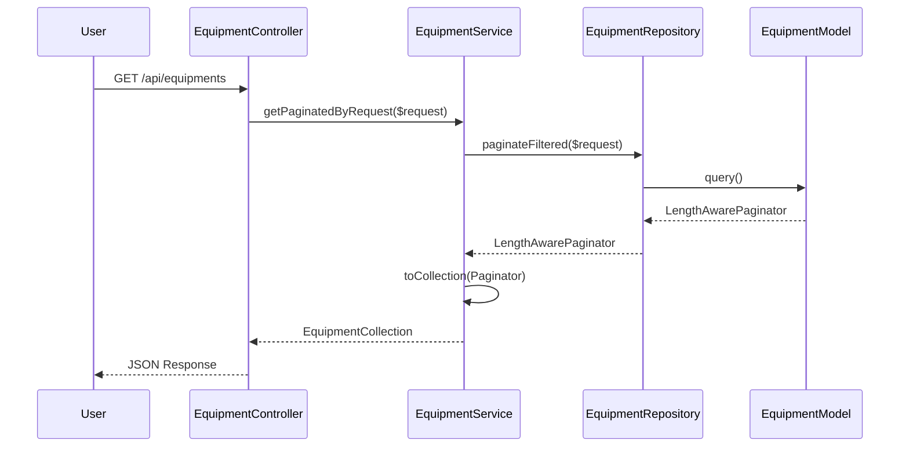

# Controller-Service-Repository Design Pattern

This project follows a strict **Controller-Service-Repository** architectural pattern to ensure separation of concerns, maintainability, and testability.

## 🏗️ Architectural Overview

The flow of data through the application typically follows this path:

1.  **Request**: An HTTP request hits the route and is handled by a **Controller**.
2.  **Validation**: The Controller uses a **Form Request** to validate the input.
3.  **Service**: The Controller delegates the business logic to a **Service**.
4.  **Repository**: The Service interacts with a **Repository** for data persistence and retrieval.
5.  **Data**: The Repository uses **Eloquent Models** and **Spatie QueryBuilder** to interact with the database.
6.  **Response**: The Service returns a **Resource** (or Collection) back to the Controller, which returns a JSON response.

---

## 🛠️ Layer Responsibilities

### 1. Controllers (`app/Http/Controllers/Api`)
Controllers are thin and strictly handle:
-   Receiving HTTP requests.
-   Authorization (using Policies).
-   Injecting the appropriate Service.
-   Returning JSON responses using `BaseApiController` helpers (e.g., `respondWithResource`, `respondWithCollection`).

**Example**: [EquipmentController.php](file:///Users/yusufkaracaburun/Sites/localhost/laravel/skeleton-1/api/app/Http/Controllers/Api/EquipmentController.php)

### 2. Services (`app/Services`)
Services encapsulate business logic and act as the "glue" between controllers and repositories.
-   They are bound via interfaces (e.g., `EquipmentServiceInterface`).
-   They inherit from `BaseService`.
-   They use the `TransformsResources` trait to convert Models/Collections into API Resources.
-   They handle operations that might involve multiple repositories or external APIs.

**Example**: [EquipmentService.php](file:///Users/yusufkaracaburun/Sites/localhost/laravel/skeleton-1/api/app/Services/Concretes/EquipmentService.php)

> [!TIP]
> **Why the 3-way split?**
> You might see the same method in the **Interface**, the **BaseService**, and the **Concrete**. 
> - Always **Inject the Interface** in your Controller.
> - The **BaseService** defines the CRUD methods as **abstract**, forcing each service to follow the standard structure.
> - The **Concrete Service** implements these methods, ensuring they return the correct **Resource** class.

### 3. Repositories (`app/Repositories`)
Repositories abstract the data layer.
-   They inherit from `BaseRepository` or `QueryableRepository`.
-   `QueryableRepository` integrates with **Spatie QueryBuilder**, allowing for easy filtering, sorting, and including related models directly from URL parameters.
-   They define `getAllowedFilters`, `getAllowedSorts`, and `getAllowedFields`.

**Example**: [EquipmentRepository.php](file:///Users/yusufkaracaburun/Sites/localhost/laravel/skeleton-1/api/app/Repositories/Concretes/EquipmentRepository.php)

---

## 🔗 Dependency Injection & Binding

Dependencies are injected via constructor injection using **Interfaces**. This allows for easy swapping of implementations and mocking during tests.

Bindings are registered in specific Service Providers:
-   **Services**: [ServiceServiceProvider.php](file:///Users/yusufkaracaburun/Sites/localhost/laravel/skeleton-1/api/app/Providers/ServiceServiceProvider.php)
-   **Repositories**: [RepositoryServiceProvider.php](file:///Users/yusufkaracaburun/Sites/localhost/laravel/skeleton-1/api/app/Providers/RepositoryServiceProvider.php)

```php
// In ServiceServiceProvider.php
$this->app->bind(EquipmentServiceInterface::class, EquipmentService::class);
```

---

## 📐 Base Classes & Helpers

### `BaseRepository`
Provides standard CRUD methods: `all()`, `find()`, `create()`, `update()`, `delete()`.

### `QueryableRepository`
Extends `BaseRepository` to provide advanced querying capabilities via `Spatie\QueryBuilder`. It supports:
-   `paginateFiltered(Request $request)`: Automatically applies filters/sorts from the request.

### `BaseService`
Holds the repository instance and defines standard CRUD methods (`create`, `update`, etc.) as **abstract**. This ensures that every service provides a consistent implementation that returns transformed Resources.

### `TransformsResources`
A trait used in Services to simplify the transformation of Eloquent entities into API Resources.

---

## 🔄 Sequence Diagram (Equipment Flow)



---

## 💡 Best Practices
-   **Thin Controllers**: No business logic or DB queries in controllers.
-   **Interface Injection**: Always inject the `Interface`, not the `Concrete` class.
-   **Thin Services**: If a service method just calls a repository method, that's fine—it maintains the architectural layer.
-   **Fat Repositories**: Put complex Eloquent queries and Spatie configurations in Repositories.
